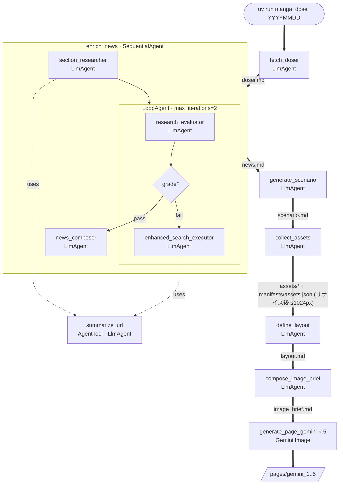

# manga_dosei

報道された首相動静をもとに、その日の出来事を 1 ページの漫画にまとめる日次パイプラインです。

[English README](README.md)


> 生成されたページは公開情報をもとに AI が作成したフィクションです。登場する人物・団体とは一切関係なく、内容について一切の責任を負いません。

## 概要

`manga_dosei` は ADK を使ったワークフローで、対象日の首相の予定を 1 ページの漫画にまとめます。各実行は `target_date` (`YYYYMMDD`) をキーとした 1 セッションになり、各ステップが artifact を書き出して次のステップがそれを入力にします。中間成果物をあえてファイルとして外に出しているので、任意のステップだけを `adk web` から再実行することもできます。

## パイプライン



図の見通しを優先して省いた非 LLM ヘルパー — 各 `LlmAgent` は実際には下記のツールを駆動しています:

- `fetch_dosei`
  - `search_jiji_for_dosei` — Tavily REST、JIJI.COM 限定
  - `fetch_url` — httpx
- `section_researcher` / `enhanced_search_executor`
  - `search_news_jiji` — Tavily REST、JIJI.COM 限定
  - `search_news_yahoo` — Tavily REST、Yahoo!ニュース限定
  - `summarize_url` — 内部の子 `LlmAgent` (図に表示済み)
    - `fetch_url` — httpx。生 HTML を親 context に漏らさないため自前の `InMemorySessionService` 内で実行
- `collect_assets`
  - `wiki_image_search` — Wikimedia Commons API
  - `wiki_image_info` — Wikimedia Commons API
  - `download_image` — httpx
- `collect_assets` と `define_layout` の間
  - `resize_assets` — `FunctionTool` (Pillow LANCZOS)。参考画像の長辺が 1024px を超えた場合のみ新バージョンとして書き戻す

各ステップは ADK の 1 ツールに対応し、それぞれ後段が依存する artifact 名を必ず出します。**ストーリー**・**版下構造**・**画像生成ブリーフ** を別ファイルに分けてあるので、1 つだけ作り直しても全体を再生成する必要はありません。

| # | ステップ | 出力 artifact | 役割 |
|---|---|---|---|
| 1 | `fetch_dosei` | `dosei.md` | エージェント型ツールループ: `LlmAgent` がまず `search_jiji_for_dosei` (Tavily) で記事 URL を見つけ、続いて `fetch_url` (httpx) で本文 HTML を取得して、対象日の `首相動静` を末尾の 配信日時 行ごと一字一句転記する。要約しない。 |
| 2 | `enrich_news` | `news.md` | `SequentialAgent` が 3 段階を調停: **section_researcher** (初期 findings 収集) → **LoopAgent** (最大 2 周。**research_evaluator** が pass/fail と follow-up クエリを判定 → **EscalationChecker** (自前 `BaseAgent`) が grade=="pass" でループを抜ける → **enhanced_search_executor** が follow-up を全消化して findings を再生成) → **news_composer** (findings + `dosei.md` を最終 markdown にまとめる)。両 researcher は同じ 3 ツール `search_news_jiji` / `search_news_yahoo` / `summarize_url` を共有。`summarize_url` はさらに `AgentTool` で子 `LlmAgent` をラップしており、子セッション内で `fetch_url` を呼んで要約だけ親に返すため、生 HTML が親 context に漏れない。出力には漫画ネタ候補 (A=インパクト / B=政策決定 / C=人物エピソード)、人物プロフィール、面会の文脈、周辺政治情勢が出典付きで含まれる。 |
| 3 | `generate_scenario` | `scenario.md` | 単一の `LlmAgent` が `news.md` を元に漫画台本を起こす: タイトル、4〜5 コマぶんのコマタイトル、コマごとの 状況 / イラスト / セリフ (verbatim・番号付き)、登場人物一覧、X 投稿用テキスト。**ストーリーの正典** で、以降のステップはここに書かれた内容を組み直したり描画したりするだけ。 |
| 4 | `collect_assets` | `assets/<name>.<ext>` + `manifests/assets.json` | エージェント型ツールループ: `LlmAgent` が `scenario.md` の登場人物一覧を読み、`wiki_image_search` (Wikimedia 候補検索) → `wiki_image_info` (ライセンス・寸法確認) → `download_image` (取得 + 保存) を繰り返して最大 7 枚 (人物優先) を集める。manifest にはソース URL、ライセンス、MIME type を記録。 |
| 5 | `resize_assets` | `assets/<name>.<ext>` の新バージョン | 長辺が 1024px を超える参考画像を Pillow + LANCZOS で縮小。元バージョンは artifact ストアに残る。 |
| 6 | `define_layout` | `layout.md` | コマ数と展開からレイアウトカタログ (`assets/layouts/{3a,4a,4b,4c,4d,5a}/`) の `pattern_id` を 1 つ選び、正準 ASCII 図と段配置を一字一句転記。さらにセリフ番号順から導いたコマ別キャラ配置 (画面左 / 画面右) を書く。**版下構造のみ** で、タイトル・セリフ・視覚要素は持たない。 |
| 7 | `compose_image_brief` | `image_brief.md` | `scenario.md` + `layout.md` + `news.md` + `manifests/assets.json` を統合した、画像生成のための単一ブリーフ。ページヘッダ (verbatim)、登場人物プロフィール (参照画像あり/なしフラグ付き)、layout の ASCII 図、コマ別仕様 (位置 + キャラ配置 + 状況/イラストの手がかり + verbatim 吹き出し) を含む。`(verbatim)` と書かれたフィールドだけがページに文字として描画される対象。 |
| 8 | `generate_page_gemini` (×5) | `pages/gemini_<N>.<jpg\|png>` | `image_brief.md` を Gemini Image に渡し、3 種類の参照画像を添付: 該当 `pattern_id` のレイアウトサンプル (`assets/layouts/<pattern_id>/sample.jpg`)、高市早苗キャラ参照 (`assets/samples/sanae.jpg`)、リサイズ済み `assets/*` 画像群。内部リトライなしで `PAGE_VARIANT_COUNT` 回呼ばれ、5 枚のバリアントから手動で最良を選ぶ。 |

日次 CLI は現状 Gemini Image のみを利用します。`generate_page_gpt` (OpenAI GPT Image、`PAGE_VARIANT_COUNT=2`) は ADK エージェントには登録されていて `adk web` から呼び出せますが、`uv run manga_dosei` 経由では呼ばれません (構図と文字描画の安定性が Gemini のほうが高いため)。

## 使用技術

- **言語**: Python 3.12
- **ツール / ライブラリ**: uv, httpx, BeautifulSoup, Pillow ほか
- **フレームワーク**: [Google ADK](https://github.com/google/adk-python)
- **LLM (text)**: Gemini (デフォルト `gemini-3.1-pro-preview`)
- **LLM (image)**: Gemini Image (デフォルト `gemini-3-pro-image-preview`)。OpenAI GPT Image (`gpt-image-2`) はエージェント経由で利用可能ですが日次 CLI からは呼びません
- **Web 検索**: [Tavily REST API](https://docs.tavily.com/) を `make_tavily_search_tool` でコード側パラメータ固定にして利用 (LLM は `query` のみ決める)
- **データソース**: JIJI.COM (www.jiji.com)、Yahoo!ニュース (news.yahoo.co.jp)、Wikimedia Commons

## 必要環境

Gemini、OpenAI、Tavily の API キー (`.env.example` 参照)。

## セットアップ

```bash
uv sync
cp .env.example .env   # GEMINI_API_KEY, OPENAI_API_KEY, TAVILY_API_KEY, WIKIMEDIA_CONTACT_EMAIL を記入
```

## 使い方

対象日 (`YYYYMMDD`) を指定してパイプラインを一括実行します:

```bash
uv run manga_dosei 20260410
```

セッションと artifact は `.adk/` 配下に保存されます。

ADK Web UI から同じストレージを参照して状態を確認・再開する場合:

```bash
uv run adk web \
  --session_service_uri="sqlite:///$(pwd)/.adk/sessions.db" \
  --artifact_service_uri="file://$(pwd)/.adk/artifacts" \
  .
```

リポジトリのルートで実行してください (CLI が書く `.adk/` と同じディレクトリを `$(pwd)` で参照させるため)。絶対パスが必須です — `file://./...` の形式だと `.` が host として解釈されて「`file://` artifact URIs must reference the local filesystem.」で起動失敗します。
