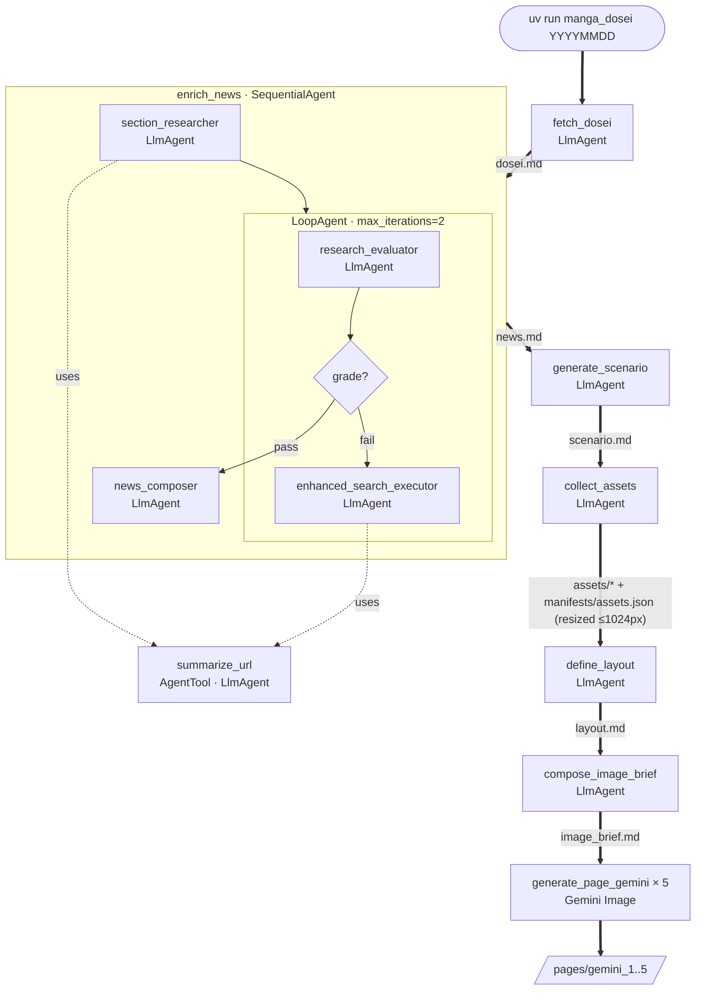

# manga_dosei

A daily pipeline that turns the Japanese Prime Minister's published schedule (`首相動静`, *shushou dōsei*) into a one-page manga.

[日本語版 README](README.ja.md)


> Generated pages are AI-created fiction based on publicly reported schedules. They are not endorsed by, affiliated with, or representative of any of the people or organizations depicted, and no responsibility is taken for their content.

## Overview

`manga_dosei` is an ADK workflow that summarizes the Prime Minister's agenda for a given date as a one-page manga. Every run is keyed by `target_date` (`YYYYMMDD`); each step writes an artifact under that session, and the next step consumes those artifacts. The intermediate files are deliberately exposed (not in-memory) so any step can be re-run independently from `adk web`.

## Pipeline



Non-LLM helpers omitted from the diagram for readability — each `LlmAgent` actually drives the following tools:

- `fetch_dosei`
  - `search_jiji_for_dosei` — Tavily REST, JIJI.COM only
  - `fetch_url` — httpx
- `section_researcher` / `enhanced_search_executor`
  - `search_news_jiji` — Tavily REST, JIJI.COM only
  - `search_news_yahoo` — Tavily REST, Yahoo! News only
  - `summarize_url` — wrapped child `LlmAgent` (shown in the diagram)
    - `fetch_url` — httpx, run inside its own `InMemorySessionService` so raw HTML stays out of the parent context
- `collect_assets`
  - `wiki_image_search` — Wikimedia Commons API
  - `wiki_image_info` — Wikimedia Commons API
  - `download_image` — httpx
- Between `collect_assets` and `define_layout`
  - `resize_assets` — `FunctionTool` (Pillow LANCZOS), produces new artifact versions only when a reference image's long side exceeds 1024 px

Each step is one ADK tool, and each produces a stable artifact name that downstream steps depend on. The narrative content, the page structure, and the final image-gen brief are intentionally separate files so you can edit one without rebuilding the rest.

| # | Step | Produces | What it does |
|---|---|---|---|
| 1 | `fetch_dosei` | `dosei.md` | Agent-driven tool loop: the `LlmAgent` calls `search_jiji_for_dosei` (Tavily) to find the article URL, then `fetch_url` (httpx) to pull the page HTML, then transcribes the day's `首相動静` verbatim (including the trailing 配信日時 line). No summarization. |
| 2 | `enrich_news` | `news.md` | `SequentialAgent` orchestrating 3 stages: **section_researcher** (gather initial findings) → **LoopAgent** (max 2 iterations: **research_evaluator** grades pass/fail and emits follow-up queries → **EscalationChecker** (custom `BaseAgent`) exits the loop when grade=="pass" → **enhanced_search_executor** runs the follow-ups and re-emits findings) → **news_composer** (merges findings + `dosei.md` into the final markdown). Both researchers share the same three tools: `search_news_jiji`, `search_news_yahoo`, and `summarize_url` — itself an `AgentTool` wrapping a child `LlmAgent` that calls `fetch_url` in an isolated session so raw HTML never reaches the parent context. Output covers 漫画ネタ候補 (A=インパクト / B=政策決定 / C=人物エピソード), per-person profiles, meeting context, and surrounding political background — all with sources. |
| 3 | `generate_scenario` | `scenario.md` | Single `LlmAgent` that drafts the actual manga script from `news.md`: page title, 4–5 panel titles, per-panel 状況 / イラスト / dialogue (verbatim, numbered), 登場人物一覧, and X-post text. **Sole authority for narrative content** — downstream steps only restructure or render what's here. |
| 4 | `collect_assets` | `assets/<name>.<ext>` + `manifests/assets.json` | Agent-driven tool loop: the `LlmAgent` reads `scenario.md`'s cast list, then iterates `wiki_image_search` (find Wikimedia candidates) → `wiki_image_info` (license + dimensions) → `download_image` (fetch + save) until it has ≤7 references, people first. The manifest records source URL, license, and MIME type per image. |
| 5 | `resize_assets` | `assets/<name>.<ext>` (new versions) | Downsizes any reference image whose long side exceeds 1024 px using Pillow + LANCZOS. Original versions are kept on the artifact store. |
| 6 | `define_layout` | `layout.md` | Picks a `pattern_id` from the layout catalog (`assets/layouts/{3a,4a,4b,4c,4d,5a}/`) based on panel count and pacing, then transcribes the canonical ASCII figure and per-row layout verbatim and adds per-panel character placement (画面左 / 画面右) derived from speaker order. Layout-only — no titles, dialogue, or visuals. |
| 7 | `compose_image_brief` | `image_brief.md` | Merges `scenario.md` + `layout.md` + `news.md` + `manifests/assets.json` into a single self-contained brief for the image generator: page header (verbatim), 登場人物プロフィール (with 参照画像あり/なし flag), the layout's ASCII figure, and per-panel specs (position + character placement + situation/illustration hints + verbatim balloons). Fields tagged `(verbatim)` are the only things meant to render as on-page text. |
| 8 | `generate_page_gemini` (×5) | `pages/gemini_<N>.<jpg\|png>` | Feeds `image_brief.md` to Gemini Image along with three kinds of reference: the layout sample (`assets/layouts/<pattern_id>/sample.jpg`), the Takaichi Sanae character reference (`assets/samples/sanae.jpg`), and the resized `assets/*` images. No internal retry — variant count comes from `PAGE_VARIANT_COUNT`. The best variant is picked manually. |

The daily CLI currently uses only the Gemini Image backend. `generate_page_gpt` (OpenAI GPT Image, `PAGE_VARIANT_COUNT=2`) is still registered on the ADK agent and reachable from `adk web`, but is not invoked by `uv run manga_dosei` — Gemini gives more reliable composition and on-page text rendering.

## Tech stack

- **Language**: Python 3.12
- **Tooling**: uv, httpx, BeautifulSoup, Pillow, …
- **Framework**: [Google ADK](https://github.com/google/adk-python)
- **LLM (text)**: Gemini (`gemini-3.1-pro-preview` by default)
- **LLM (image)**: Gemini Image (`gemini-3-pro-image-preview` by default; OpenAI GPT Image `gpt-image-2` is available through the ADK agent but is not invoked by the daily CLI)
- **Web search**: [Tavily REST API](https://docs.tavily.com/) (parameters fixed in code via `make_tavily_search_tool`; the LLM only chooses `query`)
- **Data sources**: JIJI.COM (www.jiji.com), Yahoo! News (news.yahoo.co.jp), Wikimedia Commons

## Requirements

API keys for Gemini, OpenAI, and Tavily (see `.env.example`).

## Setup

```bash
uv sync
cp .env.example .env   # then fill in GEMINI_API_KEY, OPENAI_API_KEY, TAVILY_API_KEY, WIKIMEDIA_CONTACT_EMAIL
```

## Usage

Run the full pipeline for a given date (`YYYYMMDD`):

```bash
uv run manga_dosei 20260410
```

Outputs (sessions and artifacts) are written under `.adk/`.

To inspect or resume a session interactively via the ADK Web UI, pointing it at the same storage:

```bash
uv run adk web \
  --session_service_uri="sqlite:///$(pwd)/.adk/sessions.db" \
  --artifact_service_uri="file://$(pwd)/.adk/artifacts" \
  .
```

Run this from the repository root so `$(pwd)` resolves to the same directory the CLI writes into. Absolute paths are required: `file://./...` is parsed with `.` as a host name and rejected ("file:// artifact URIs must reference the local filesystem").
